## Administration UI tour

Everything this library adds to the Xperience administration is in two places, and the first one is
not where most people look. Start here:

**Lucene Search** (in the **Development** category) **→ List of registered Lucene indices → click the
index row → the *Edit index (xps)* sidebar**

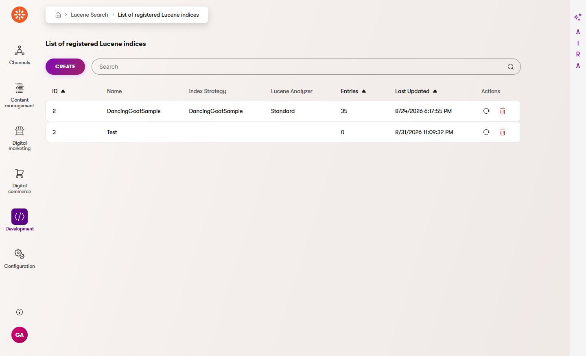

Clicking a row opens that index's tuning section. The URL of every page in it is
`/admin/lucene/indexes/edit/{indexId}/{page}` — the tour below uses index `2`
(*DancingGoatSample*), so `…/edit/2/rules` is the Rules page of that index.

The second place is the **Search ingestion** application, also under **Development**
(`/admin/xpsearch-tuning`). It holds exactly two pages — **API keys** and **Ingestion log** — because
they are about systems pushing data in, not about one index.

### Why the tuning pages live inside the Lucene integration

Tuning belongs to a search index. Rather than duplicating an index picker on a dozen forms, this
library grafts its pages onto the index the Lucene integration already knows about:

- A page extender replaces the listing's row action, so clicking an index row opens
  `IndexTuningSection` instead of the integration's bare edit form. Nothing about the listing itself
  changes.
- Two URL segments carry you there: the static `edit` segment (breadcrumb **Edit index**) and, under
  it, the segment that carries the index identifier (breadcrumb **Edit index (xps)**). Both render
  nothing of their own; the sidebar under them is the tour.
- The integration's own configuration form is not lost — it is the **Settings** page of the sidebar,
  so everything about one index is in one place.

One consequence is worth knowing before you assign roles: because these pages hang under the
integration's application, they are governed by the **Lucene Search** application in *Role
management*, not by *Search ingestion*. *View* reads them, *Create*/*Update*/*Delete* change them,
and the separate *Rebuild* permission is what the Status page's rebuild button evaluates. A
*View*-only role must reach the sidebar by clicking the index row, because the index's own
configuration form evaluates *Update*.

You never pick an index on any form in this section. The index you clicked is shown read-only at the
top of every form, and each listing is filtered to it; a row belonging to another index cannot be
edited or deleted through this URL.

| Sidebar entry | URL under `…/edit/{indexId}/` | Child pages |
|---|---|---|
| **Settings** | `settings` | — |
| **Rules** | `rules` | `rules/create`, `rules/{ruleId}/edit`, `rules/from-query/{seed}` |
| **Suggestions** | `suggestions` | — |
| **Synonyms** | `synonyms` | `synonyms/create`, `synonyms/{id}/edit` |
| **Synonym suggestions** | `synonym-suggestions` | — |
| **Stopwords** | `stopwords` | `stopwords/create`, `stopwords/{id}/edit` |
| **Field weights** | `weights` | `weights/create`, `weights/{id}/edit` |
| **Query tester** | `query-tester` | — |
| **Analytics** | `analytics` | — |
| **Experiments** | `experiments` | `experiments/create`, `experiments/{id}/detail`, and the four variant listings |
| **Status** | `status` | — |

### Settings

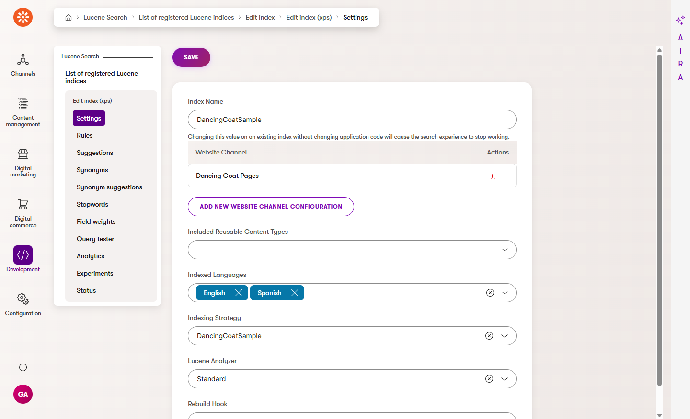

The Lucene integration's own index form, re-parented into the sidebar: **Index Name**, the website
channel configurations, **Included Reusable Content Types**, **Indexed Languages**, **Indexing
Strategy**, **Lucene Analyzer**, **Rebuild Hook**, and **Save**. Renaming an index without changing
the application code that searches it breaks the search experience — the form says so under the
field.

This page evaluates *Update*, and it is the page a row click lands on.

Depth: [Indexing strategy](indexing-strategy.md).

### Rules

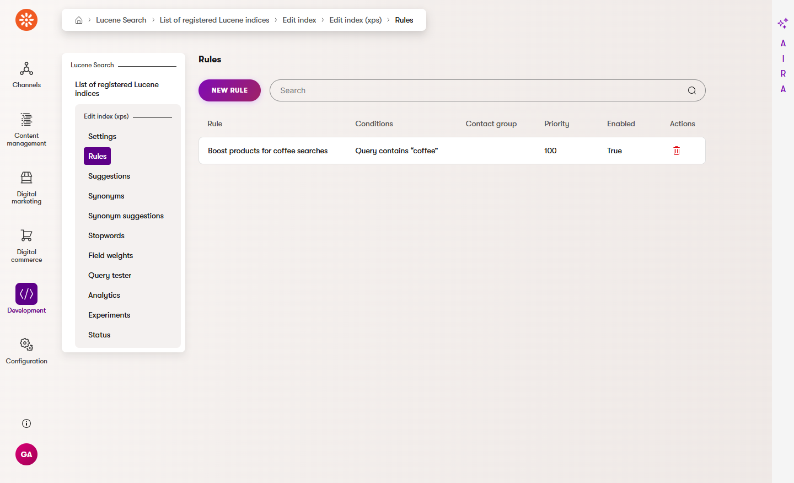

One row per if/then rule of this index, with the columns **Rule**, **Conditions** (the same
human-readable summary the builder shows), **Contact group** (empty means everyone), **Priority**,
**Enabled** and a delete action. **New rule** opens the builder empty.

The listing grows a callout with a link when the popularity task has left suggested rules waiting —
see [Suggestions](#suggestions) below.

#### The rule builder

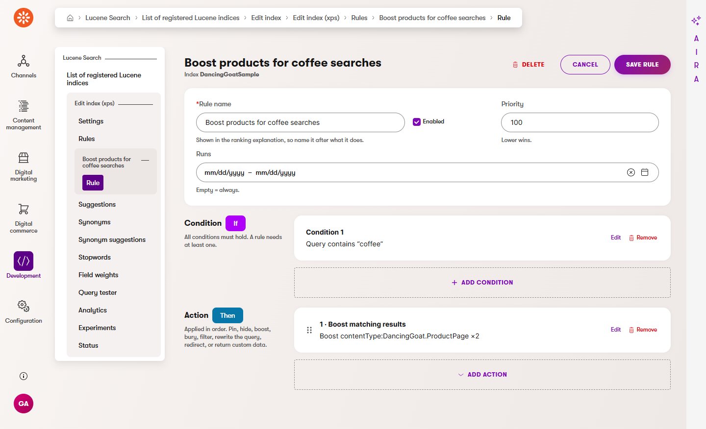

Opening a rule (or **New rule**) opens the builder, one screen with three regions:

- **The settings strip** — **Rule name**, **Enabled**, **Priority** (lower wins) and **Runs**, the
  date-range validity window. Empty means always.
- **Condition — If** — one card per condition, each a read-only summary such as
  `Query contains "coffee"`. **Edit** on a card and **Add condition** open the side panel; nothing is
  saved until **Save rule**.
- **Action — Then** — one numbered row per action, applied in order, reorderable by the grip.
  The seeded rule's single action reads `1 · Boost matching results — Boost contentType:DancingGoat.ProductPage ×2`.

**Delete**, **Cancel** and **Save rule** sit in the page header. A rule with no condition at all
cannot be saved.

The rule builder is also where the Analytics dashboard's **Create rule** shortcut lands, through the
hidden `rules/from-query/{seed}` page: the seed carries the index and the query that found nothing,
so the builder opens with that condition already in place.

Depth: [Relevance tuning](relevance-tuning.md).

### Suggestions

Suggested **boost rules** mined by the `XpSearch.PopularitySignal` scheduled task: queries where one
result clearly wins the clicks. Each row carries the query, the result and the evidence, with
**Approve** (which creates an ordinary rule you can then edit like any other) and **Dismiss**. Both
answers are final for that pair.

The capture above is from a host where the task has not produced any suggestion yet, so the page
shows its quick tip and *There are no records to display* — which is also what you see before the
task configuration exists at all.

Depth: [Popularity boosts and mined suggestions](popularity-boosts.md).

### Synonyms

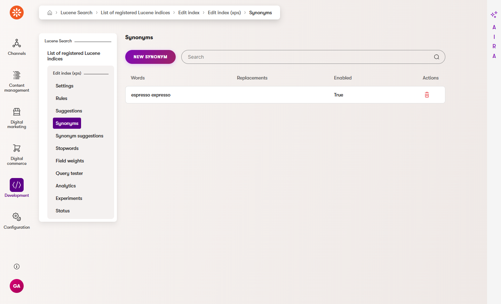

One row per synonym group, with **Words**, **Replacements** (filled only for a one-way group),
**Enabled** and a delete action.

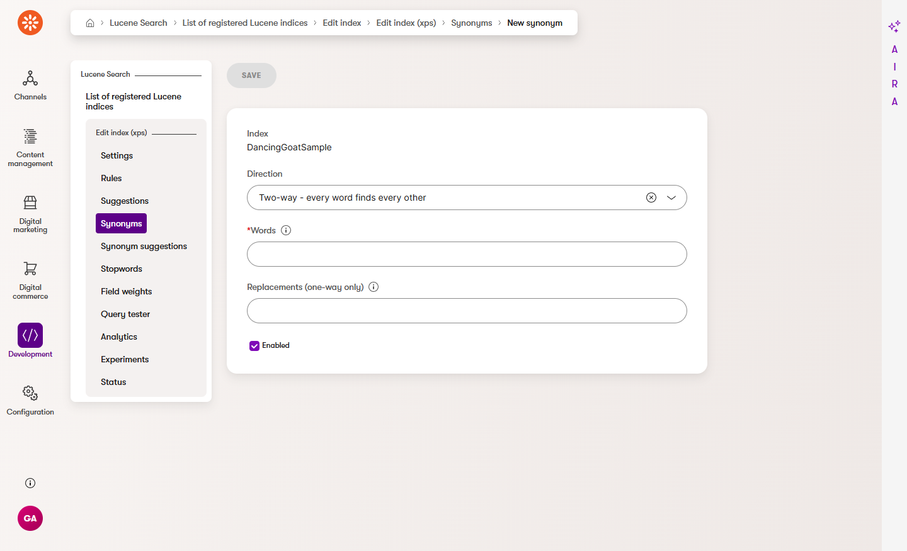

**New synonym** asks for **Direction** (*Two-way - every word finds every other*, the default, or
one-way), **Words**, **Replacements (one-way only)** and **Enabled**. The index is shown read-only
at the top, as on every form in this section.

The header also carries **Turn typo tolerance on/off**, the index-wide opt-in that lets misspelled
searches match, with a callout above the table saying which state the index is in. It is off by
default.

Depth: [Relevance tuning → Synonyms](relevance-tuning.md#synonyms) and
[→ Typo tolerance](relevance-tuning.md#typo-tolerance).

### Synonym suggestions

Pairs mined from real searches: a search that got no click, followed within a minute by a different
search that did. **Approve** creates an ordinary two-way group on the Synonyms page; **Dismiss**
hides the pair for good. The quick tip on the page is explicit that the pairing is by timing rather
than by visitor — read the evidence before approving.

As with Suggestions, the captured host had no mined pairs at the time, so the table reads *There are
no records to display*.

Depth: [Popularity boosts → Suggested synonyms](popularity-boosts.md#suggested-synonyms).

### Stopwords

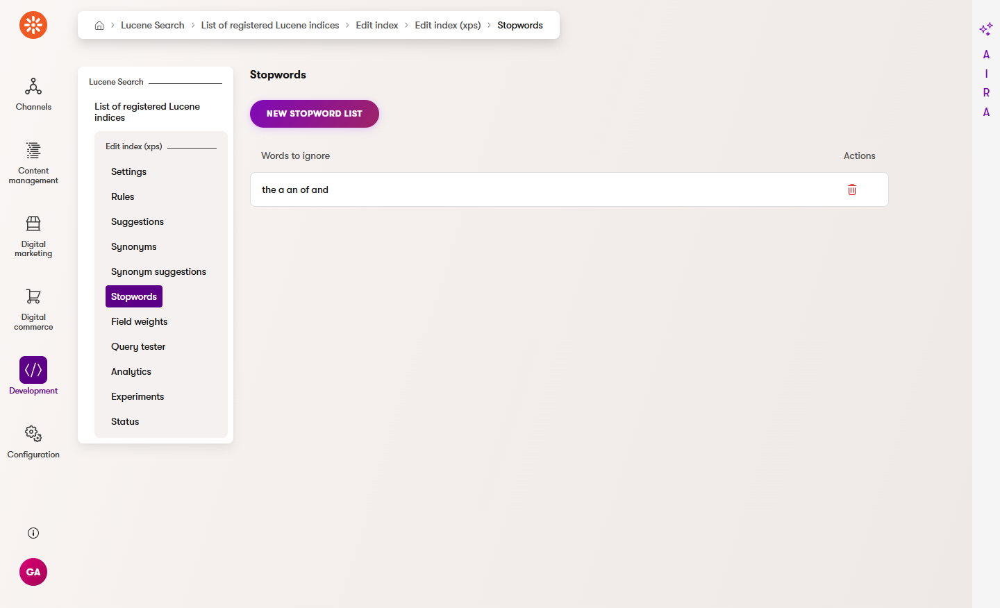

One stopword list per index — the listing has a single **Words to ignore** column and a delete
action. If a list already exists, edit it rather than creating a second.

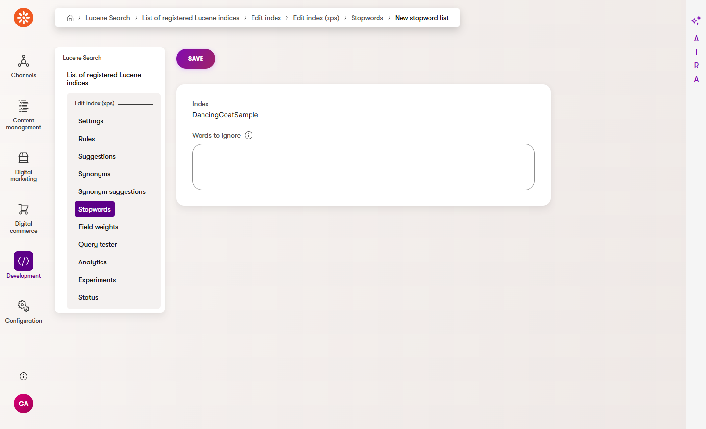

Depth: [Relevance tuning → Stopwords](relevance-tuning.md#stopwords).

### Field weights

**Field** and **Weight**, one row per weighted field. Two header actions:

- **New field weight** — the form below.
- **Boost by popularity** — the index-wide opt-in for popularity ranking. The button reads **Stop
  boosting by popularity** once it is on, and the callout above the table always names the current
  state: *Boost by popularity: off* (as captured) or *Boost by popularity: on*. This is a per-index
  setting, not per rule and not per experiment variant.

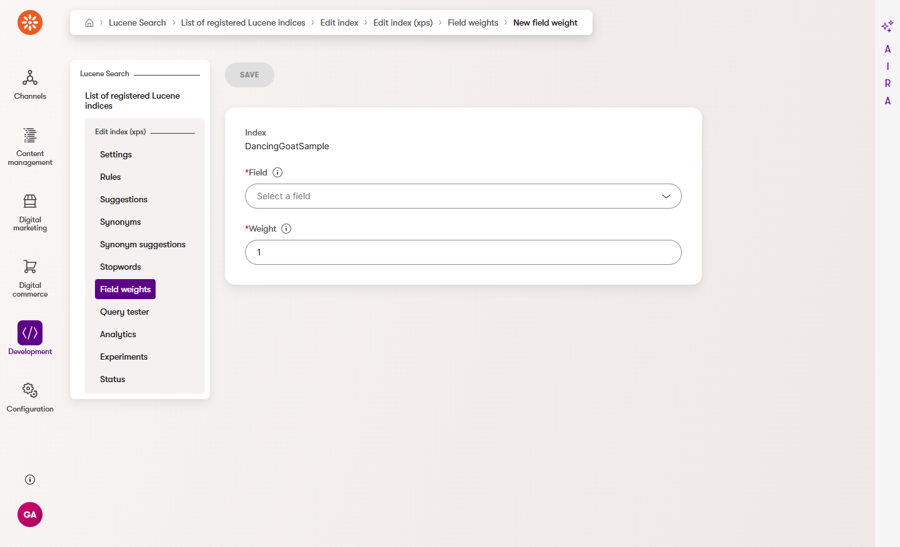

**Field** is a drop-down of the index's searchable fields, discovered from the schema — nothing is
typed from memory. **Weight** starts at `1`.

Depth: [Relevance tuning → Field weights](relevance-tuning.md#field-weights) and
[Popularity boosts](popularity-boosts.md).

### Query tester

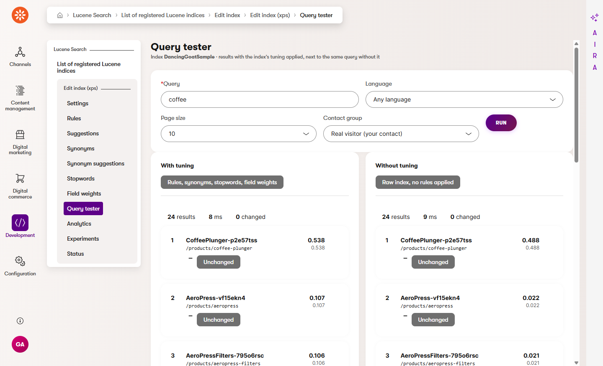

Runs one query twice — once with this index's rules, synonyms, stopwords and field weights, once with
none of them — and shows both rankings with their score explanations. The controls are **Query**
(required), **Language** (*Any language* by default), **Page size** (10, 25 or 50), **Contact group**
(*Real visitor (your contact)* by default, or any contact group to see what a member would get) and
**Run**. A **Variant** select joins them only while the index has an unfinished experiment, offering
that experiment's variant B.

Read the capture carefully, because it is a useful non-result. Both columns report *24 results* and
*0 changed*, even though the seeded rule *Boost products for coffee searches* did fire: the rule
boosts every document of `contentType:DancingGoat.ProductPage` by ×2, and on this query every hit is
a product page, so every score is multiplied by the same factor and nothing changes place. The
scores differ between the columns (`0.107` with tuning against `0.022` without on the second row),
the order does not. *N changed* counts results whose position differs, so a boost that lifts
everything equally is correctly reported as changing nothing — that is the tester telling you the
rule is too broad to be worth its priority slot.

Tester runs are never written to the query log, so nothing you do here shows up in Analytics.

Depth: [Relevance tuning → Checking your work](relevance-tuning.md#checking-your-work-the-query-tester).

### Analytics

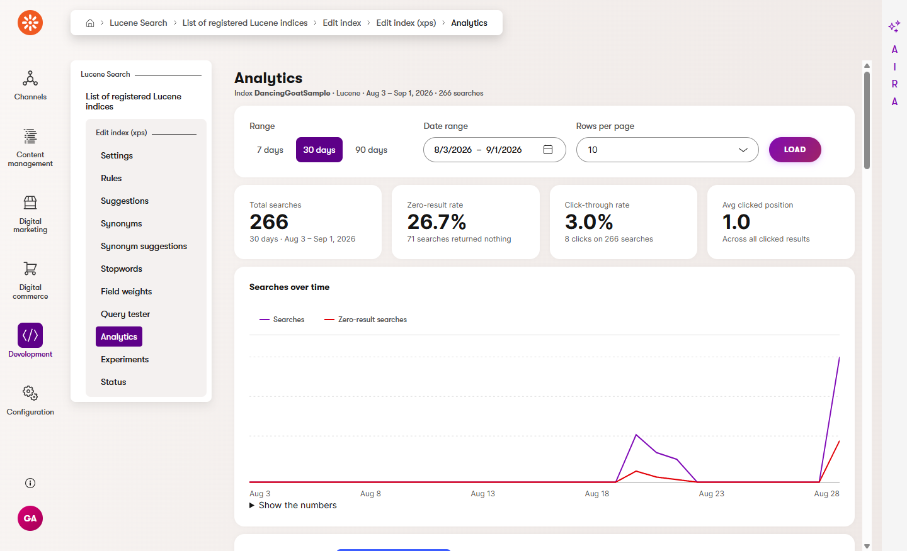

Everything the anonymous query log knows about this index, for one date range: the **Range** toggle
(7 / 30 / 90 days), a **Date range** picker, **Rows per page** and **Load**; then four KPI tiles
(*Total searches*, *Zero-result rate*, *Click-through rate*, *Avg clicked position*), the **Searches
over time** chart with its *Show the numbers* table, and four report tables — **Zero-result
queries**, **Top queries**, **Click-through** and **Slowest queries**.

Only one control on this page changes anything: the **Create rule** button on every zero-result row,
which opens the rule builder seeded with that query.

Depth: [Search analytics](analytics.md).

### Experiments

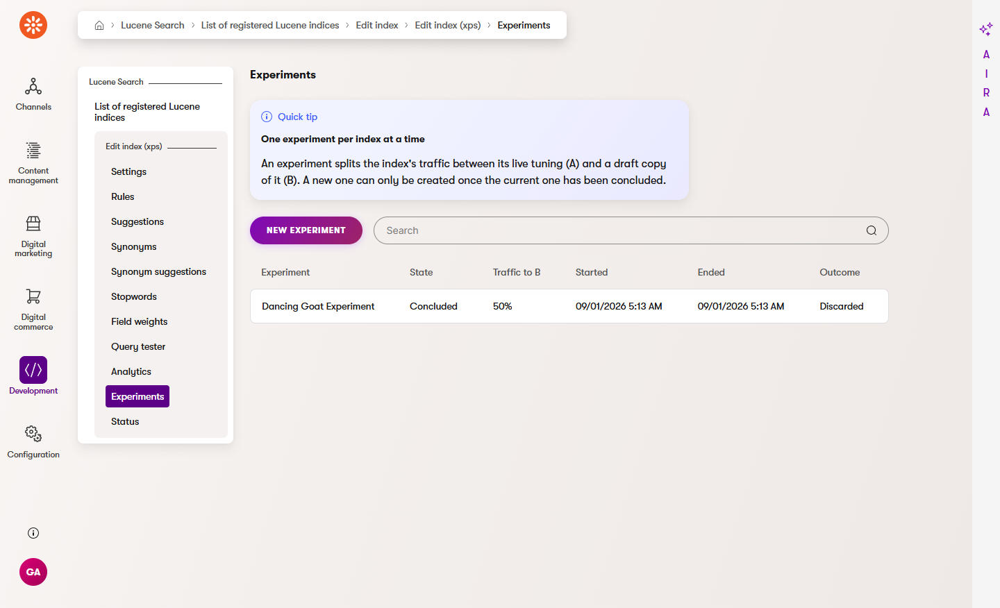

One row per experiment of this index: **Experiment**, **State**, **Traffic to B**, **Started**,
**Ended** and **Outcome**. Only one unfinished experiment per index is allowed, which the quick tip
says out loud.

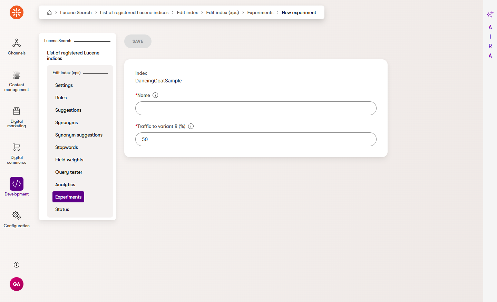

**New experiment** asks for a **Name** and **Traffic to variant B (%)** (1–99, default `50`).
Creating it copies the index's entire live tuning into variant B; nothing is live yet.

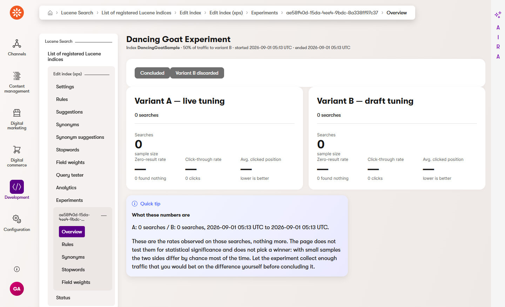

The experiment's **Overview** is the state machine: a draft can have its split changed and can be
**started**; a running experiment can be concluded with **Promote B to live** or **Discard B**, both
behind a confirmation. The two cards are **Variant A — live tuning** and **Variant B — draft
tuning**, each showing searches, zero-result rate, click-through rate and average clicked position
over the window the experiment ran in. There is deliberately no winner badge and no p-value.

The captured experiment is **Concluded** with the outcome **Variant B discarded**, and it was started
and concluded inside the same minute, so both sides read *0 searches* and every rate is blank. That
is what an experiment with no traffic looks like — the report shows observed rates and their sample
size, and refuses to invent anything when the sample is zero.

#### The variant-scoped copies of the four tuning listings

Notice the sidebar in the capture above: while you are inside an experiment, the section grows its
own child navigation — **Overview**, **Rules**, **Synonyms**, **Stopwords**, **Field weights** —
under `…/edit/{indexId}/experiments/{experimentId}/`. These are the *same editors* as the live
listings, scoped to variant B instead of to the live tuning, which is why the sidebar entries repeat
the same four names.

Every one of them carries a banner naming the experiment, and the banner is the state indicator:

- While the experiment is a **draft**, it is a quick tip — *You are editing the experiment's variant
  B, not the live tuning of the index* — and the listings behave normally: create, edit, delete.
- Once the experiment has **started**, it turns into a friendly warning — *This experiment is
  running, so its variant B is read-only* — and the create, edit and delete actions are gone from the
  page. A test whose halves change half-way through measures nothing.

A concluded experiment keeps the read-only banner. If it was concluded by **Discard B**, variant B's
rows were deleted, so those four listings are empty; if it was **promoted**, its rows *are* the live
tuning now and you will find them on the live Rules, Synonyms, Stopwords and Field weights pages.

There are no variant copies of Suggestions or Synonym suggestions: mined suggestions apply to the
live tuning only.

Depth: [Experiments — A/B testing your tuning](experiments.md).

### Status

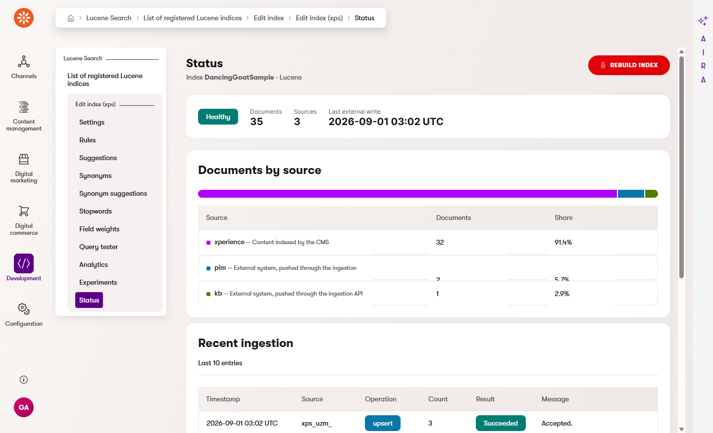

Three questions, top to bottom: is the index healthy (**Healthy** or **Degraded**, next to the
document count, the number of sources and the last external write), where did the documents come from
(**Documents by source** — `xperience` is content indexed by the CMS, everything else was pushed
through the ingestion API), and what happened recently (**Recent ingestion**, the last ten log
entries for this index).

**Rebuild index** sits in the header, asks for confirmation, and evaluates the *Rebuild* permission
rather than *Update*. A rebuild empties the index and writes it again, so search results are
incomplete while it runs.

Depth: [Relevance tuning → Reading the Status page](relevance-tuning.md#reading-the-status-page).

### The Search ingestion application

Two pages, at `/admin/xpsearch-tuning`, in the **Development** category. They are not per index.

#### API keys

Columns: **Name**, **Prefix**, **Scopes**, **Enabled**, **Expires**, **Last used**, plus a delete
action that revokes the key. Only the hash of a key is stored — the quick tip on the page says so —
which is why the listing shows a prefix such as `xps_uzm_` and never the key itself.

**New API key** asks for **Name**, **Indexes** (comma-separated code names, or `*` for every index —
the default), **Operations** (comma-separated `write`, `delete`, `rebuild`, `read`, or `*`; the
default is `write,delete`) and an optional **Expires**. The page deliberately does not redirect after
saving: the plaintext key is in the success message at the top of the screen, exactly once.

#### Ingestion log

Every write into search, newest first: **When**, **Key** (the prefix, so a write is attributable
without exposing the key), **Index**, **Operation** (`upsert`, `clear`, `rebuild`), **Documents**,
**Succeeded** and **Outcome**. The **Filter** button narrows the log to one index. Rebuilds triggered
from the Status page are logged here too, under the key `admin-ui`.

Depth: [Ingestion](ingestion.md).

### Related pages

- [Relevance tuning](relevance-tuning.md) — rules, synonyms, stopwords, field weights and the query
  tester in depth.
- [Search analytics](analytics.md) — what the dashboard reads and how the query log is kept.
- [Popularity boosts and mined suggestions](popularity-boosts.md) — the scheduled task behind both
  suggestion pages and the popularity toggle.
- [Experiments — A/B testing your tuning](experiments.md) — the full A/B workflow.
- [Ingestion](ingestion.md) — the API the keys and the log belong to.
- [Indexing strategy](indexing-strategy.md) — what the Settings page's strategy and analyzer do.
