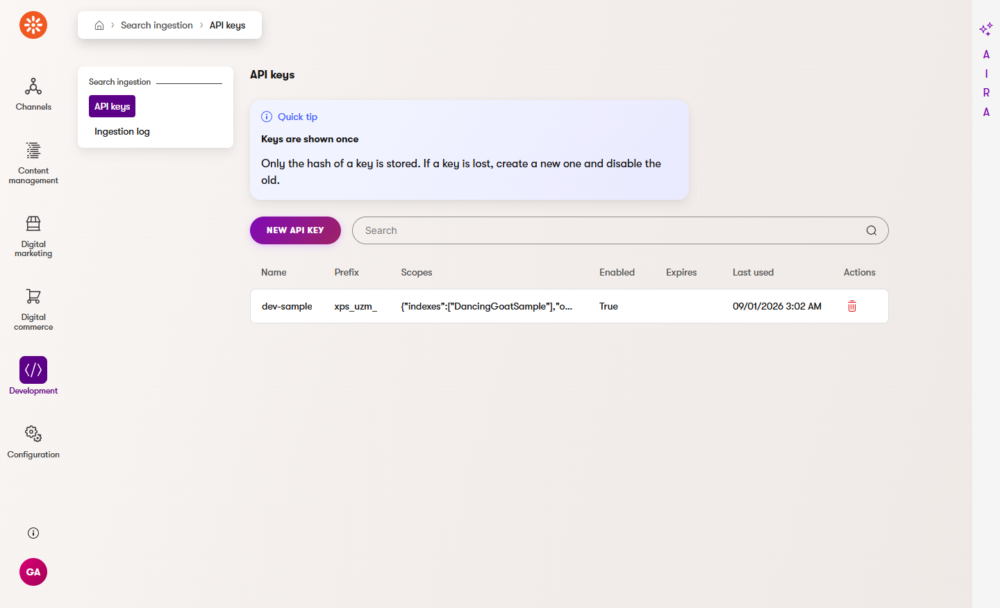
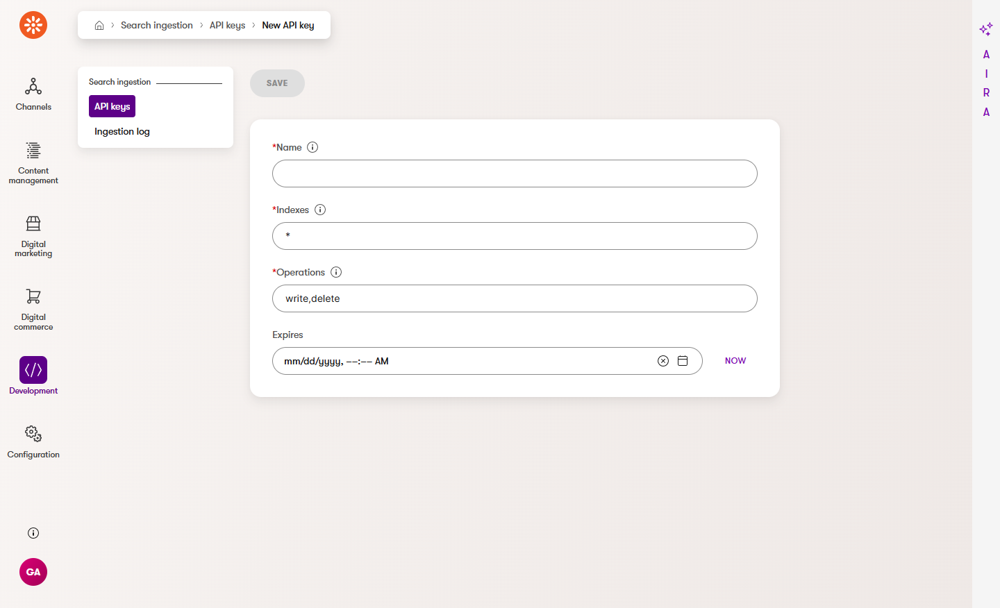
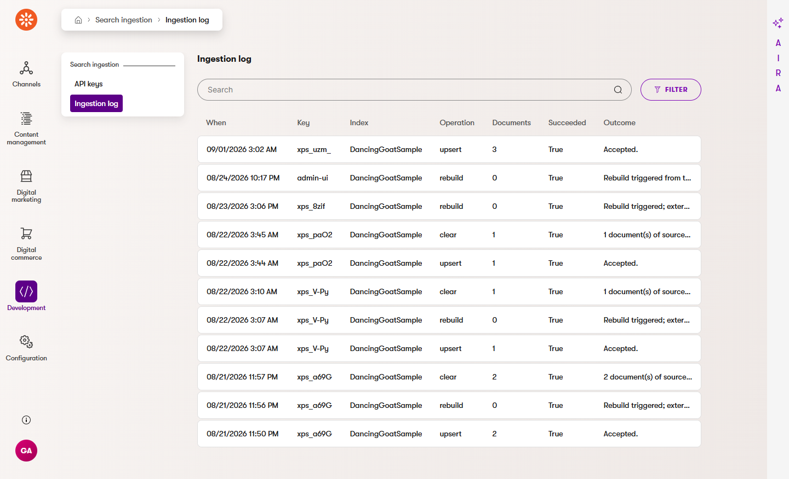

## Ingestion

Push documents from anywhere — a PIM, a support knowledge base, a legacy system nobody is migrating —
into the same Lucene index Xperience content lives in, and search across both. Documents are addressed
by an `id` you own, carry a `_source` that keeps them apart from Xperience content, and are validated
against the index schema before anything is written.

### Push a document

```bash
curl -X POST "https://example.com/api/xpsearch/admin/indexes/products/documents" \
  -H "Authorization: Bearer xps_YOUR_KEY" \
  -H "Content-Type: application/json" \
  -d '{
    "documents": [
      {
        "id": "pim-sku-88213",
        "_source": "pim",
        "title": "Ethiopian Yirgacheffe",
        "sku": "88213",
        "price": 18.50,
        "publishedAt": 1735689600,
        "inStock": true,
        "tags": ["coffee", "single-origin"]
      }
    ]
  }'
```

```jsonc
{ "indexed": 1, "failed": 0, "errors": [], "taskId": "b3f1…", "tookMs": 22 }
```

The write is persisted immediately and indexed on a background thread; `taskId` is there so you can
poll `GET /api/xpsearch/admin/indexes/products/status` and watch the count move.

### Endpoints

All under `/api/xpsearch/admin/`, all authenticated with a bearer API key. The query endpoint
(`/api/xpsearch/query`) is separate and public by default.

| Route | Does | Answers |
|---|---|---|
| `POST indexes/{index}/documents` | Upsert one or many | `200` `UpsertResponse` |
| `PATCH indexes/{index}/documents/{id}` | Change some attributes | `200` `UpsertResponse` |
| `DELETE indexes/{index}/documents/{id}` | Delete one | `200` `DeleteResponse` |
| `POST indexes/{index}/documents/delete` | Delete by `ids` or by `filter.source` | `200` `DeleteResponse` |
| `POST indexes/{index}/clear?source=pim` | Delete a whole source, or every external source | `200` `DeleteResponse` |
| `POST indexes/{index}/rebuild` | Rebuild Xperience content, then replay external documents | `202` `UpsertResponse` |
| `GET indexes/{index}/status` | Counts by source, last write, health | `200` `IndexStatus` |
| `GET indexes` | Every index and its schema | `200` `IndexListResponse` |

Every response carries `X-XpSearch-Api-Version: 1`. Failures are RFC 9457 Problem Details; a document
that fails validation is *not* a failed request — it comes back in `errors`, keyed by `id` and `field`,
while the rest of the batch is written.

The route names are constants in C#: `XpSearch.Ingestion.Contract.IngestionContractConstants`
(`DocumentsRoute`, `ClearRoute`, `StatusRoute`, …).

### Wire it up

```csharp
// Program.cs — after AddKenticoLucene() and AddXpSearch()
builder.Services.AddXpSearchIngestion(options =>
{
    options.DefaultSource = "external";           // used when a document sends no _source
    options.MaxDocumentsPerRequest = 1_000;       // 413 above this
    options.RateLimitPermitsPerWindow = 60;       // per API key, per window
});

var app = builder.Build();
app.UseKentico();
app.UseRateLimiter();                             // required for the per-key rate limit
app.MapXpSearch();
app.MapXpSearchIngestion();
```

Order matters: `AddXpSearchIngestion()` decorates whatever `ILuceneClient` is registered when it runs,
so it must come after `AddKenticoLucene()` and `AddXpSearch()`. On first start the library installs
three custom module classes — `XpSearch.ExternalDocument`, `XpSearch.ApiKey` and
`XpSearch.IngestionLog` — through its own startup module.

### API keys

Keys are scoped per index and per operation, and hashed with PBKDF2-HMAC-SHA256 before they are stored.
The plaintext exists exactly once, at creation:

```csharp
public class CreatePimKey(IApiKeyService keys)
{
    public async Task<string> RunAsync(CancellationToken cancellationToken)
    {
        var created = await keys.CreateAsync(
            "PIM sync",
            new ApiKeyScopes { Indexes = ["products"], Ops = ["write", "delete"] },
            expiresAt: DateTime.UtcNow.AddYears(1),
            cancellationToken);

        return created.Key;   // "xps_…" — show it once; only created.Record.Hash is stored
    }
}
```

Send it as `Authorization: Bearer xps_…`. A key that is unknown, disabled or expired gets `401`; a key
that is fine but not scoped to this index or this operation gets `403`. Scope is checked before
existence, so an out-of-scope key never learns whether an index exists. `["*"]` in either list is a
wildcard. Every write is recorded in the ingestion log with the key prefix, the index, the document
count and the outcome.

Keys are created in the administration, in **Search ingestion → API keys** (under *Development*).
The plaintext is shown once, in the message at the top of the screen, and never again. You can also
create them from code, once, and hand the plaintext to the integration.



The listing shows the key's **Prefix**, never the key: only its PBKDF2 hash is stored. **New API
key** takes **Name**, **Indexes** (comma-separated code names or `*`, the default), **Operations**
(comma-separated `write`, `delete`, `rebuild`, `read` or `*`; `write,delete` by default) and an
optional **Expires**.



Every write those keys make is on the **Ingestion log** page next to them — when, which key prefix,
which index, the operation, the document count and the outcome, newest first, filterable by index.
Rebuilds triggered from an index's Status page are logged there too, under the key `admin-ui`.



### Schemas

Each index declares what a pushed document may carry. Declare it on the index's indexing strategy:

```csharp
[XpSearchSchema(AllowDynamicFields = false)]
[XpSearchField("title", SearchFieldKind.Text, Searchable = true, Sortable = true, Boost = 2f)]
[XpSearchField("sku", SearchFieldKind.Keyword, Facetable = true)]
[XpSearchField("price", SearchFieldKind.Number, Sortable = true)]
[XpSearchField("publishedAt", SearchFieldKind.Date, Sortable = true)]
[XpSearchField("inStock", SearchFieldKind.Boolean, Facetable = true)]
[XpSearchField("tags", SearchFieldKind.Taxonomy, Searchable = true, Facetable = true)]
public class ProductStrategy : XpSearchIndexingStrategy;
```

The declared fields are merged with the fields auto-detected from the Xperience content types the index
covers; a declared field wins. An index that holds nothing but pushed documents has no content types,
so its schema is exactly what you declare. Anything you would rather configure than annotate goes in
`AddXpSearchIngestion(o => o.Indexes["products"].Fields.Add(new SchemaField(...)))`, which wins over
both.

The wire types map to `SearchFieldKind` like this: `string` → `Keyword`, `text` → `Text`,
`number` → `Number`, `date` → `Date` (Unix epoch seconds), `boolean` → `Boolean`,
`string[]` → `Taxonomy`.

Rules when a document arrives:

- **Unknown fields are rejected** with a `400`-shaped error entry, unless the index sets
  `AllowDynamicFields = true`.
- **Coercion is narrow.** `"18.50"` becomes the number `18.50`; `"18.50 EUR"` is an error, not a guess.
  `"true"` becomes `true`; `1` does not. A single string becomes a one-element `string[]`.
- **A changed field type is called out.** If the index already stores `price` as text and the schema now
  says number, the whole batch is refused with a message that names the field and tells you to rebuild.
  Writing it anyway would leave sorting and range filters quietly broken.
- `id`, `ItemGuid` and `_source` are reserved: the API writes them.

### `waitForIndex` is a foot-gun

```jsonc
{ "documents": [ … ], "waitForIndex": true }
```

`waitForIndex: true` runs the Lucene write on the request thread and does not answer until the document
is searchable. That is what you want in a test or a five-document sync, and exactly what you do not want
for a catalogue import: every request serializes against the index writer, and a bulk load that would
have taken seconds in the background takes minutes in the foreground. Leave it off and poll
`GET …/status` instead. The single-document routes accept it as `?waitForIndex=true`.

### Freshness after a write

A write is visible to the next query in the same process, with no restart and no delay: every write
goes through the library's `ILuceneClient` decorator, which drops both the cached query responses for
the index and the Lucene integration's cached searcher. (The integration keeps one reader per index
open until something invalidates it, and its own client only invalidates on rebuild and index
deletion - which is why a write made around `ILuceneClient`, straight through an index writer, stays
invisible.) With `waitForIndex: true` the document is searchable by the time the response arrives;
without it, by the time the queued work item has run.

### Source isolation

Every document carries a `_source`. Xperience-managed content is `_source: "xperience"`; pushed
documents get theirs from the request, from the API key's integration or from
`options.DefaultSource`. Three guarantees follow:

- **A rebuild never loses pushed documents.** The Lucene integration's rebuild opens a brand-new index
  generation and re-indexes Xperience content only, so external documents disappear from Lucene. They
  do not disappear from the database, and the rebuild queues a replay of them behind itself
  ([ADR-0005](../adr/0005-ingestion-durability.md)).
- **`clear` is scopeable.** `POST …/clear?source=pim` deletes that source and nothing else; without a
  source it deletes every *external* source. Neither can touch Xperience content, and asking for
  `source=xperience` is a `400`.
- **Counts are per source.** `GET …/status` reports `documents.bySource`, so "did the PIM sync land"
  is one request. The same numbers, with a per-source bar and the last ten log entries, are on the
  **Status** page of the index (**Lucene Search → indexes → *index* → Edit index → Status**); see
  [Reading the Status page](relevance-tuning.md#reading-the-status-page). Both `documents.total` and every `bySource` entry count *live* documents in the
  current index generation - deleted and replaced copies that Lucene has not merged away yet are not
  counted - so the entries always add up to the total.
- **`_source` is facetable.** Ask for it in `facets` to get the counts a search sees, or filter to one
  provenance with `filters.facets`, exactly like `contentType`.

Like `rebuild`, **`clear` and `delete` are asynchronous unless you send `waitForIndex: true`**: the
response carries a `taskId` and reports how many *stored* documents were removed, while the Lucene
half runs on the ingestion queue. `GET …/status` is therefore eventually consistent - a status read
straight after a `clear` can still report the pre-clear counts. That lag is not an incident, and
`health` stays `healthy` through it; `degraded` means queued work failed to reach the index and
nothing has succeeded since.

### In-process: `IXpSearchIndexer`

Code running inside the Xperience application should skip HTTP entirely. This is the API to reach for
from a scheduled task, a custom module, a global event handler or an automation step:

```csharp
public class SyncProducts(IXpSearchIndexer indexer) : IScheduledTask
{
    public async Task<ScheduledTaskExecutionResult> Execute(ScheduledTaskConfigurationInfo task, CancellationToken cancellationToken)
    {
        var documents = new[]
        {
            SearchDocument.Create("pim-sku-88213", "pim", new Dictionary<string, object?>
            {
                ["title"] = "Ethiopian Yirgacheffe",
                ["price"] = 18.50,
                ["inStock"] = true,
                ["tags"] = new[] { "coffee", "single-origin" },
            }),
        };

        var result = await indexer.UpsertAsync("products", documents, cancellationToken: cancellationToken);

        // result.Indexed, result.Failed, result.Errors[].Id / .Field / .Message
        await indexer.DeleteAsync("products", ["pim-sku-00001"], cancellationToken: cancellationToken);
        await indexer.DeleteBySourceAsync("products", "pim-clearance", cancellationToken: cancellationToken);

        var status = await indexer.GetStatusAsync("products", cancellationToken);

        return ScheduledTaskExecutionResult.Success;
    }
}
```

`PatchAsync(index, id, attributes)` is the read-modify-rewrite partial update: the stored body is read,
the named attributes are replaced (a `null` removes one), and the document is rewritten. Lucene has no
in-place update, so there is no cheaper way — and the stored row is what makes it possible at all.

### Limits

| Limit | Default | What happens |
|---|---|---|
| Documents per request | 1000 | `413` with the limit in the message |
| Request body | 10 MB | `413` |
| Requests per key | 60 per minute | `429` (needs `app.UseRateLimiter()`) |

Nothing is ever silently truncated.

### What is not here yet

- Admin UI for schemas; schemas are declared in code on the indexing strategy. Keys and the
  ingestion log are in the **Search ingestion** application; index status is per index, at
  **Lucene Search → indexes → *index* → Edit index → Status**.
- The C# and Node convenience clients; today it is one `fetch` or one `HttpClient` call per request.
- Facet **counts** for pushed documents: they are filterable on `string[]` attributes, but the taxonomy
  sidecar the counts come from is only written for Xperience content.
