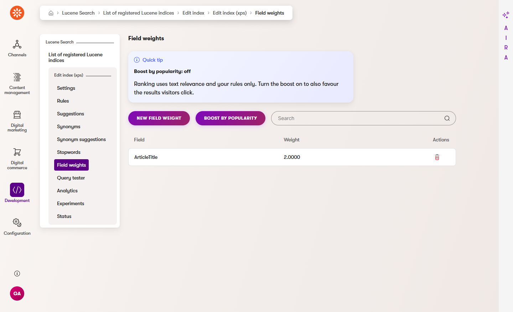
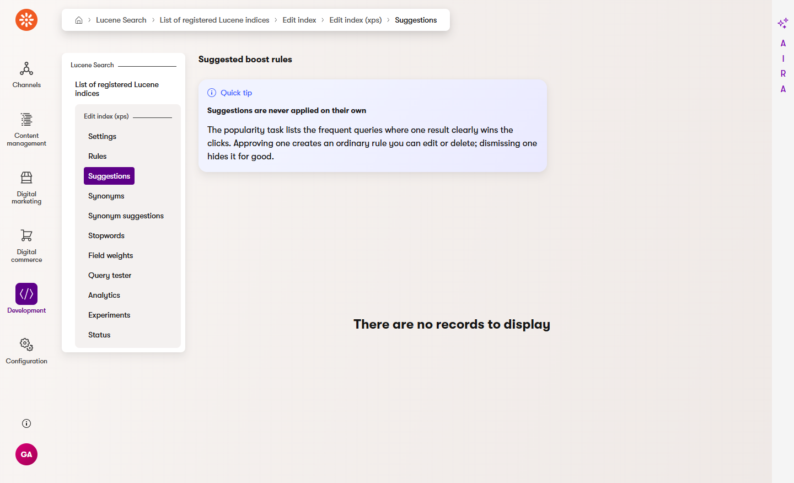
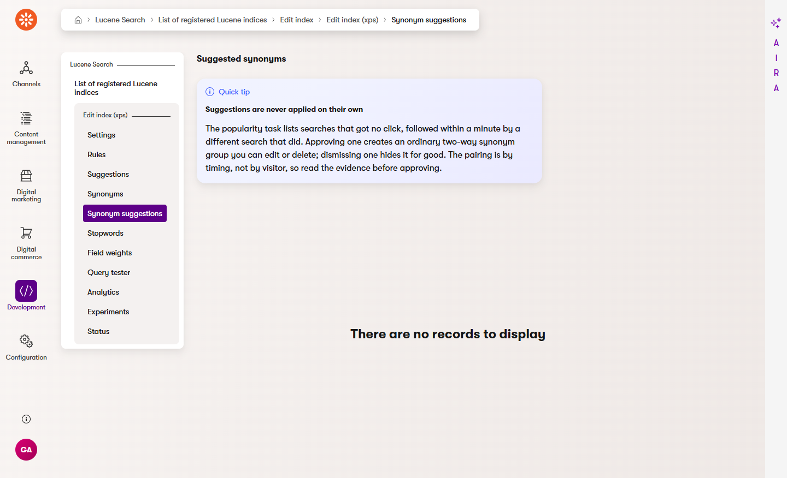

## Popularity boosts and mined suggestions

Search already knows which results your visitors click. This feature turns that into three things: an
optional, bounded ranking boost for the results people actually open, a list of *suggested* boost
rules, and a list of *suggested* synonyms mined from searches that failed and were retried. Both lists
wait for a human to approve or dismiss. Nothing here calls an external service, and nothing changes
a search until you switch it on.

It is off for every index until you turn it on, and no rule is ever created without a person clicking
**Approve**.

### How it works in one paragraph

A scheduled task reads the last 30 days of the [query log](analytics.md#the-query-log), adds up the
clicks each document received, and stores one *popularity signal* per index. If an index has opted
in, the query pipeline boosts those documents at search time — by at most 2x for the single most
clicked document, less for everything else. The same run also looks at the most frequent queries and,
where one document clearly wins a query's clicks, offers a suggested boost rule — and at searches that
got no click and were followed by a different search that did, which it offers as suggested synonyms.

### Turn it on

Two steps, in this order.

**1. Create the task configuration.** The task ships registered but Xperience only runs a task that
has a *configuration*, which can only be created in the administration:

1. Open the **Scheduled tasks** application.
2. Select **New scheduled task configuration**.
3. **Scheduled task configuration name**: `XpSearch popularity signal`.
4. **Task implementation**: `XpSearch.PopularitySignal`.
5. **Enabled**: yes. **Task schedule**: daily is plenty — the signal moves slowly.
6. **Save**.

The *Last result* column then reads like
`Popularity computed for 84 documents across 2 indexes since 2026-08-02 03:00:00Z; 3 suggested rules,
2 suggested synonyms.`

Step 2 is only about the ranking boost — both suggestion lists fill up as soon as the task runs, on
every index, opted in or not.

**2. Opt the index in.** Open **Lucene Search → indexes → your index → Edit index → Field weights**
and select **Boost by popularity** in the page header. The callout above the table tells you which
state you are in; selecting it again turns the boost back off (the button then reads **Stop boosting
by popularity**). The setting belongs to the index, not to a rule or an experiment.



Until both steps are done, ranking is exactly what it was: text relevance and your own rules.

### What the signal is

For every click the query log recorded in the window:

```text
weight = log2(position + 1)
```

A click on result **8** is worth about 3.2, a click on result **1** is worth 1.0. That is deliberate:
a click on the first result is what the ranking already recommended, while a click eight rows down is
a visitor overruling it — the more informative event. A click whose position was not reported counts
as position 1, the smallest weight there is.

Each document's weights are added up. The strongest 100 documents per index are stored; the rest are
dropped, which bounds both the stored rows and the query.

### What the boost does

At search time, each stored document gets a factor:

```text
factor = 1 + (document score / strongest score) x (2.0 - 1)
```

So the most clicked document is boosted by 2x, a document with half its evidence by 1.5x, and a
document with no evidence at all is untouched. The boost is applied exactly like a boost rule you
would write yourself, which is why it can lift a document but never bury a better text match, and why
`explain: true` reports it next to your rules:

```jsonc
POST /api/xpsearch/search
{ "index": "ProductIndex", "query": "grinder", "explain": true }

{
  "results": [
    {
      "id": "doc-4:en",
      "ranking": {
        "boosts": ["Popularity boost from 84 document(s), up to 2.0x (signal 638939232000000000)."]
      }
    }
  ]
}
```

Cached responses of an opted-in index are invalidated when a task run produces a new signal — the
signal version is part of the cache key while the boost is on, and absent while it is off.

### Suggested rules

The same run examines the window's 10 most frequent queries. A document is suggested when it takes

- at least **5 clicks** on that query, and
- at least **50 %** of that query's click weight.

Both thresholds have to hold: five clicks split three ways is not a winner, and 90 % of two clicks is
not evidence.

Open **Lucene Search → indexes → your index → Edit index → Suggestions** (the **Rules** page shows a
banner and a link when any are waiting). Each row shows the query, the result id, and the evidence —
`7 clicks, 86% of the query's clicks`.



- **Approve** creates an ordinary rule named `Popular for 'grinder'`: *if the search is `grinder`,
  then boost that document by 2x*. From that moment it is a normal rule — edit it, disable it or
  delete it on the **Rules** page like any other.
- **Dismiss** turns it down.

Either answer is final: that query and document never appear as a suggestion again, however many
times the task recomputes. Suggestions are for the live rules only; an experiment's variant B has no
suggestion list.

### Suggested synonyms

The same run also reads the window in timestamp order, per index, looking for a *reformulation*: a
search that got **no click**, followed within **60 seconds** by a **different** search that **did** get
a click. `settee` → (nothing clicked) → `sofa` → (click) says those two words mean the same thing on
your site.

Pairs are thrown away when

- one text contains the other — `coff` → `coffee` is somebody typing, `sofa` → `red sofa` is somebody
  narrowing, and neither is a synonym;
- they differ only in case or spacing;
- the pair happened fewer than **3 times** in the window.

Open **Lucene Search → indexes → your index → Edit index → Synonym suggestions** (the **Synonyms**
page shows a banner and a link when any are waiting). Each row shows what was searched for, what found
it, the evidence (`4 reformulations`) and when it last happened.



- **Approve** creates an ordinary **two-way** synonym group — `settee, sofa` — enabled straight away.
  From that moment it is a normal group on the **Synonyms** page: edit it, disable it or delete it like
  any other. If you only want the failed phrase rewritten and not the reverse, open the created group
  and switch its **Direction** to one-way with `settee` in **Words** and `sofa` in **Replacements**.
- **Dismiss** turns it down.

Either answer is final: that pair never appears as a suggestion again. Like the boost suggestions,
this is live tuning only — an experiment's variant B has no suggestion list.

> **Read the evidence before approving.** The query log holds no visitor or session identifier (and
> deliberately never will — see [Search analytics](analytics.md)), so "the same visitor searched
> again" is approximated by *timing*: two visitors searching in the same minute can produce a pair
> nobody actually made. The three-occurrence threshold is what keeps that noise out, not certainty.
> On a quiet site, raise it. See `docs/adr/0026-mined-synonyms.md`.

### Settings

```csharp
services.AddXpSearch(options =>
{
    options.Analytics.PopularityLookbackDays = 30;      // how far back clicks count
    options.Analytics.PopularityDocumentLimit = 100;    // documents kept per index
    options.Analytics.PopularitySuggestionQueries = 10; // frequent queries examined per run
    options.Analytics.SynonymWindowSeconds = 60;        // how long a retried search still counts
    options.Analytics.SynonymMinimumOccurrences = 3;    // times a pair must repeat to be suggested
});
```

These are the **defaults for every index**. One index overrides them under **Lucene Search → the
index → Search settings**, and the task then mines that index with its own numbers — see
[Per-index settings in the administration](search-api.md#per-index-settings-in-the-administration).

The lookback window is also how popularity forgets: a run replaces the index's rows completely, so a
document that stops being clicked simply stops being in them. There is no decay curve to configure.

### Where it is stored

Four module classes in `CMS.Integration.XpSearchAnalytics`, installed on first start:

| Class | Holds |
|---|---|
| `XpSearch.PopularityIndex` | one row per index: the opt-in flag and when the signal was last computed |
| `XpSearch.PopularityScore` | one row per scored document: index, result id, weight, computed-at |
| `XpSearch.PopularitySuggestion` | one row per suggestion: query, result id, clicks, share, and whether a human answered it |
| `XpSearch.SynonymSuggestion` | one row per mined pair: the two queries, how often it happened, when it last did, and whether a human answered it |

The clicked result id now also lands on the query log itself, in `LogClickedResultID` — that column is
what makes the evidence attributable to a document. It is as anonymous as the rest of the row: it
names a document, never a person, which is why the signal works for visitors who never consented to
tracking.

### The honest limits

- **The evidence comes from the ranking that produced it.** Documents that never appeared on page one
  cannot be clicked, so they cannot become popular. The position damping softens this; it does not
  remove it. Treat popularity as a nudge, never as a substitute for good text relevance.
- **A new document starts with nothing.** Popularity favours what is already known. Pin or boost new
  content by rule if it matters.
- **The signal is only as good as your click tracking.** If your front end does not send click events
  (`POST /api/xpsearch/events`), there is nothing to aggregate — the widgets do it for you, a custom
  client has to. See the [JS client guide](js-client.md).
- **It is index-wide, not per variant.** An [experiment](experiments.md) tests the tuning you wrote;
  both of its variants see the same popularity boost.
- **Mined synonyms are pairs found by timing, not by visitor.** Busy minutes produce pairs nobody
  searched; a visitor who reformulates after two minutes produces none. Read the pair, then approve.
- **A mined pair is only a candidate.** Approving `settee, sofa` makes both words find both sets of
  results — check that this is what you want, especially for brand names and product codes.

Want this pattern for a signal of your own — stock level, editorial score, a rating from another
system? [Indexing strategy → Worked example: a computed relevance field](indexing-strategy.md#worked-example-a-computed-relevance-field)
walks the sample project's version of it: compute at index time, boost in a stage of your own.

See also: [Relevance tuning](relevance-tuning.md) for rules, synonyms and field weights,
[Search analytics](analytics.md) for the query log this is built on, and
`docs/adr/0025-popularity-boosts.md` / `docs/adr/0026-mined-synonyms.md` for why the numbers are what
they are.
